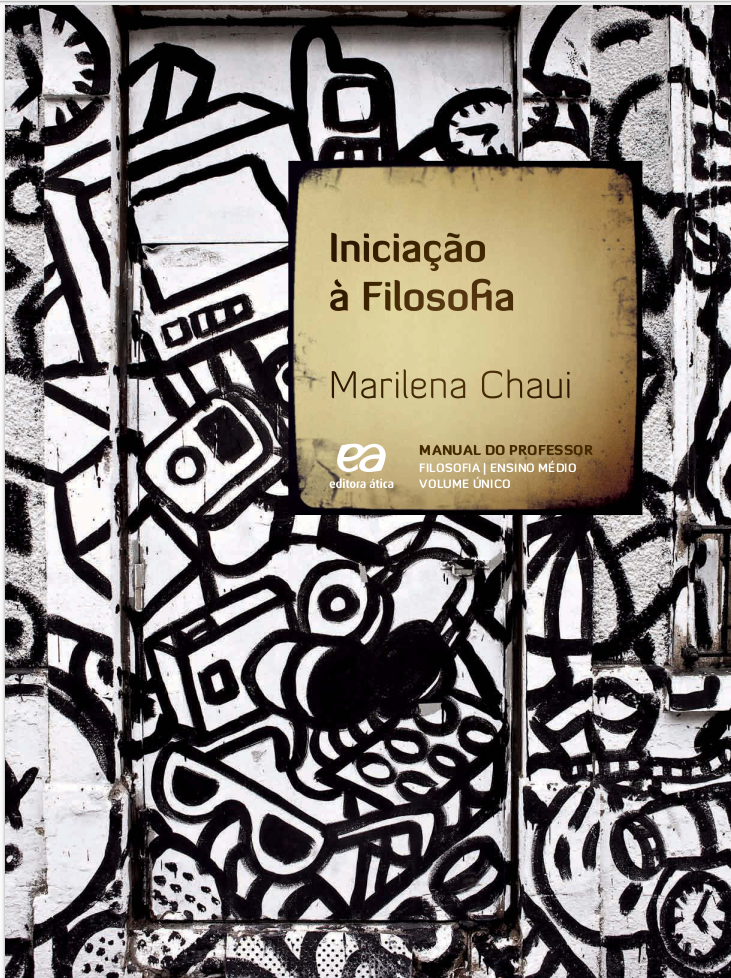

# P1 - Introdução à Filosofia

Neste capítulo estarão contidos os resumos dos slides da disciplina Introdução à Filosofia.

## Livro: Introdução à Filosofia - CHAUI - 2.ed. - 2013

```{r echo=FALSE, fig.show="hold", out.width="50%", fig.align = "center", fig.cap="Livro <b>Introdução à filosofia</b> - CHAUI - 2.ed. - 2013"}

```

* Resumo elaborado para o trabalho de História da Psicologia: "Mude minha Opinião".
* Tema do debate: "O comportamento humano pode ser controlado";

### Capítulo 28 - A Liberdade

#### Introdução

* Como é possível SER LIVRE ?
  * Se nossa vida transcorre em meio à de outrops indivíduos;
  * Se nossa vida transcorre em meio a instituições sociais;
  * Se nossa vida transcorre em meio a normas culturais;
  * Se nossa vida transcorre em meio às forças da natureza.
* A LIBERDADE é OBJETO CENTRAL dos estudos da ÉTICA como disciplina filosófica;
* A ética dedica-se:
  * A DEFINIR e ANALISAR os **elementos** que (1) **possibilitam** ou (2) **impedem** a LIBERDADE;
  * A tratar de duas grandes questões:
    * Há limites para a LIBERDADE ?
    * Como e em que termos ela pode ser INTEGRALMENTE CONQUISTADA por todos ?
    
#### A Liberdade como PROBLEMA

* Chaiu (2013, p. 278) apresenta duas questões:
  * Qual o núcleo da LIBERDADE ?
  * Como podemos sentir a AUSÊNCIA DE LIBERDADE ?
* Ela inicia o diálogo para abordar esses dois problemas apresentando:
  * Um POEMA de José Paulo Paes ("O melhor poeta da minha rua")
  * Um POEMA de Carlos Drummond de Andrade ("Sete faces")
* Os dois poemas apontam para o grande tema da ética:
  * O que está ?
  * O que não está em nosso poder ?
  * Até onde se estende o PODER:
    * Da nossa VONTADE ?
    * Do nosso DESEJO ?
    * Da nossa CONSCIÊNCIA ?
* Por fim, até onde se estende o PODER DA NOSSA LIBERDADE ?
  * O que ESTÁ EM NOSSO PODER ?
  * O que DEPENDE INTEIRAMENTE DE **CAUSAS** e **FORÇAS** EXTERIORES ?
* Mais um poema é apresentado pela autora para consolidar seu raciocínio: Vicente de Carvalho ("Velho tema")
* Os três poetas nos colocam diante da LIBERDADE como PROBLEMA, seja:
  * De modo pessimista (como em José Paulo Paes e Vicente de Carvalho)
  * De modo otimista (como em Carlos Drummond)

#### A Liberdade como QUESTÃO FILOSÓFICA

* A questão da liberdade se apresenta na forma de DOIS PARES OPOSTOS:
  * O par necessidade-liberdade
    * NECESSIDADE é o termo empregado para se referir ao todo da realidade, existente em si e por si, que age sem nós e nos insere em sua rede de causas e efeitos, condições e consequências.
  * O par contingência-liberdade
    * CONTINGÊNCIA ou ACASO significam que a realidade é imprevisível e mutável, impossibilitando deliberação e decisão racionais, definidoras da liberdade.
    * Num mundo onde tudo acontece por acidente, somos como um frágil barquinho perdido num mar tempestuoso, levado em todas as direções, ao sabor das vagas e dos ventos.
* FATALIDADE é o termo usado quando pensamos em forças transcendentes superiores às nossas e que nos governam, quer o queiramos, quer não.
* DETERMINISMO é o termo empregado, a partir do século XIX, para se referir às relações causais necessárias que regem a realidade conhecida e controlada pela ciência;
  * No caso da ética, refere-se ao ser humano como objeto das ciências naturais (química e biologia) e das ciências humanas (sociologia e psicologia). 
  * Portanto, subordina-o completamente a leis e causas que condicionam seus pensamentos, sentimentos e ações, tornando a liberdade ilusória.
* O que poderia estar em nosso poder?
* Necessidade, fatalidade, determinismo
  * Significam que não há lugar para a liberdade, porque o curso das coisas e de nossa vida já está fixado, sem que nele possamos intervir;
* Contingência e acaso
  * Significam que não há lugar para a liberdade, porque não há curso algum das coisas e de nossa vida sobre o qual pudéssemos intervir.

#### Três grandes CONCEPÇÕES FILOSÓFICAS DA LIBERDADE

* Na mitologia grega NECESSIDADE e CONTINGÊNCIA
  * Necessidade: As Moiras ( conhecidas também como Parcas ) eram as três irmãs que determinavam o destino (FATALIDADE), tanto dos deuses, quanto dos seres humanos.
  * A contingência (ou o acaso): Era representada pela Fortuna, mulher volúvel e caprichosa, que trazia nas mãos uma roda, fazendo-a girar de tal modo que quem estivesse no alto (a boa fortuna ou boa sorte) caísse (infortúnio ou má sorte) e quem estivesse embaixo fosse elevado.
    * INCONSTANTE, INCERTA e CEGA: a RODA DA FORTUNA era a pura sorte, boa ou má, contra a qual nada se poderia fazer;
* As **TEORIAS ÉTICAS** procuraram sempre enfrentar o duplo problema da necessidade e da contingência, definindo o campo da liberdade possível

##### PRIMEIRA: As concepções de Aristóteles e de Satre

* ARISTÓTELES
  * Postulou a **PRIMEIRA** grande **TEORIA FILOSÓFICA DA LIBERDADE** (Livro Ética a Nicômaco)
  * Nesse sentido, a LIBERDADE se opõe ( Necessidade x Contingência )
    * Ao que é CONDICIONÁDO EXTERNAMENTE (Necessidade)
    * Ao que ACONTECE SEM ESCOLHA DELIBERADA (Contingência)
  * Afirma que "É livre aquele que tem em si mesmo o PRINCÍPIO para AGIR ou NÃO AGIR";
  * LIBERDADE:
    * É o poder PLENO e INCONDICIONAL da VONTADE para determinar a si mesmo (**AUTODETERMINAÇÃO**);
    * É uma CAPACIDADE que 
      a. Não encontra **obstáculos** para se realizar;
      c. Nem é **forçada** por **coisa alguma** para agir;
  * Contingência ( Puro acaso ) x Possível ( Pode acontecer desde que o ser humano DELIBERE e DECIDA realizar uma ação )
  * LIBERDADE:
    * É o princípio para escolher entre **ALTERNATIVAS POSSÍVEIS**
    * Realiza-se:
      a. Decisão
      b. Ato Voluntário
 * Contrariamente à necessidade e à contingência, sob as quais o agente sofre a ação de uma CAUSA EXTERNA que o OBRIGA A AGIR de determinada maneira no ATO VOLUNTÁRIO LIVRE o agente é causa de si, isto é, CAUSA INTEGRAL DE SUA AÇÃO.
 * Sem dúvida, seria possível dizer que a VONTADE LIVRE é determinada:
    * Pela RAZÃO;
    * Pela INTELIGÊNCIA;
      a. Nesse caso, seria preciso admitir que não é causa de si ou incondicionada
      b. Nesse caso é CAUSADA
        a. Pelo RACIOCÍNIO;
        b. Pelo PENSAMENTO
* FILÓSOFOS POSTERIORES A ARISTÓTELES
  * A INTELIGÊNCIA
    * Inclina a VONTADE para certa direção;
    * Não obriga nem constrange a VONTADE
    * Podemos agir na direção contrária à indicada pela inteligência ou razão;
* JEAN-PAUL SATRE
  * LIBERDADE
    * É a ESCOLHA INCONDICIONAL que o próprio homem faz de seu ser e de seu mundo.
    * Estamos condenados à LIBERDADE;
      a. É ela que define a humanidade dos humanos, sem escapatória.
  * Quando julgamos estar sob o PODER DE FORÇAS EXTERNAS mais poderosas do que nossa VONTADE, esse julgamento é uma decisão livre;
    * OUTROS outros homens, nas mesmas circunstâncias, não se curvaram nem se resignaram;
  * QUANDO OUTROS poderiam, nas mesmas circunstâncias, AGIR DE FORMA DIFERENTE a DECISÃO É LIVRE:
    * Conformar-se ou resignar-se é uma DECISÃO LIVRE;
    * Afirmar-se ENFRAQUECIDO ou Afirma-se SEM FORÇAS para fazer alguma coisa é uma DECISÃO LIVRE;
* Essa PRIMEIRA concepção **MANTÉM** a OPOSIÇÃO entre LIBERDADE e NECESSIDADE;

##### SEGUNDA: A concepção que une NECESSIDADE e LIBERDADE

* Apresentada:
  * Pelo ESTOICISMO no período Helenístico
  * No século XVII com ESPINOSA;
  * No século XIX com HEGEL;
* PRESERVA a ideia ARISTOTÉLICA que:
  * A liberdade é AUTODETERMINAÇÃO;
  * É livre quem age sem ser forçado nem constrangido por nada nem por ninguém ( AGIR EXPONTÂNEO )
* DISTANCIA-SE da ideia ARISTOTÉLICA e de SATRE:
  * Ao NÃO SITUAR a LIBERDADE no ATO DE ESCOLHA realizado pela VONTADE INDIVIDUAL, **separada** da NECESSIDADE e OPOSTA A ELA;
* A LIBERDADE é colocada como parte de UM TODO NECESSÁRIO ( AGE LIVREMENTE quem AGE NECESSÁRIAMENTE )
* Para essa perspectiva filosófica, NECESSÁRIO significa aquilo que AGE apenas pela FORÇA INTERNA de sua PRÓPRIA NATUREZA (Estóicos) / SUBSTÂNCIA (Espinosa) / ESPÍRITO (Hegel);
* NATUREZA (Estóicos) / SUBSTÂNCIA (Espinosa) / ESPÍRITO (Hegel) são a TOTALIDADE como PODER ABSOLUTODE AÇÃO;
* Como **NADA EXTERIOR** obriga a **NATUREZA**, a **SUBSTÂNCIA** ou o **ESPÍRITO** a AGIR, eles são LIVRES, pois agem apenas por seu PODER INTERNO;
* Seu agir é uma NECESSIDADE LIVRE ou uma LIBERDADE NECESSÁRIA porque:
  * A NECESSIDADE não é um PODER EXTERNO que obriga a LIBERDADE a AGIR;
  * A NECESSIDADE é apenas a **LEI INTERNA** que a própria LIBERDADE **criou para sua própria ação**
* A LIBERDADE não é um PODER INCONDICIONADO PARA ESCOLHER — a natureza não escolhe, a substância não escolhe, o espírito não escolhe.
* A LIBERDADE é o PODER DO TODO para **AGIR EM CONFORMIDADE CONSIGO MESMO**:
  * Sendo necessariamente O QUE É;
  * Fazendo necessariamente O QUE FAZ;
  * Sendo necessariamente O QUE É;
  * Fazendo necessariamente O QUE FAZ.
* Essa SEGUNDA concepção **NÃO MANTÉM** a OPOSIÇÃO entre LIBERDADE e NECESSIDADE;
  * Ela afirma que a NECESSIDADE é a maneira pela qual a LIBERDADE do TODO se manifesta;
  * A TOTALIDADE
    * É LIVRE porque:
      a. Se põe a si mesma na existência;
      b. Define por si mesma as leis e as regras de sua atividade;
    * É NECESSÁRIA porque:
      a. Tais LEIS e REGRAS exprimem necessariamente **O QUE ELA É** e **O QUE ELA FAZ**;
* **LIBERDADE não é ESCOLHER e DELIBERAR, mas AGIR ou FAZER alguma coisa EM CONFORMIDADE com a NATUREZA DO AGENTE que, no caso, é o TODO**.
* O que é a LIBERDADE HUMANA enquanto o homem é uma parte constituída pelo todo e que age no interior do todo?
  * São duas as respostas a essa questão:
    * A PRIMEIRA (dada pelos estoicos e por Hegel) afirma que o todo é racional e que suas partes também o são, sendo livres quando agirem em conformidade com as leis racionais do todo, para o bem da totalidade;
    * A SEGUNDA (dada por Espinosa) afirma que as partes são de mesma essência que o todo e, portanto, são RACIONAIS e LIVRES como ele, dotadas de FORÇA INTERIOR para agir por si mesmas, de sorte que a LIBERDADE é TOMAR PARTE ATIVA na atividade do todo.
      a. **TOMAR PARTE ATIVA** significa:
        a. Por UM LADO:
          a. Conhecer as CONDIÇÕES e CAUSAS estabelecidas pelo todo;
          b. Conhecer o MODO como elas determinam nossas ações;
        * Por OUTRO LADO (em virtude de tal conhecimento):
          a. Não ser um joguete das CONDIÇÕES e CAUSAS que atuam sobre nós
          b. AGIR sobre elas também
* NÃO SOMOS LIVRES para escolher tudo;
* SOMOS LIVRES para fazer tudo quanto esteja de acordo [ Graças ao conhecimento que temos: (1) de nós mesmos e (2) das circunstâncias ]:
  * Com nosso ser;
  * Com nossa capacidade de agir;
* Para os ESTÓICOS, o homem livre é aquele
  * Cuja RAZÃO conhece:
    * A necessidade natural;
    * A necessidade de sua própria natureza;
  * Tem força para guiar e dirigir a vontade para que esta exerça um poder absoluto sobre a irracionalidade dos instintos e impulsos, isto é, sobre as paixões.
* Para ESPINOSA, o homem livre é aquele que
  * AGE como CAUSA interna, completa e total de sua ação
  * AGE decorrente do **desenvolvimento espontâneo** da **essência racional** do agente.
  * Em outras palavras, assim como:
    * O todo age livremente pela necessidade de sua essência;
    * O indivíduo livre age por necessidade de sua própria essência.
  * Somos livres quando realizamos nosso ser como uma potência interna capaz de uma pluralidade simultânea de ideias, afetos e ações que decorrem apenas de nosso próprio ser.
  * Somos livres quando:
    * O que somos exprimem nossa FORÇA INTERNA para existir e agir
    * O que sentimos exprimem nossa FORÇA INTERNA para existir e agir
    * O que fazemos exprimem nossa FORÇA INTERNA para existir e agir
    * O que pensamos exprimem nossa FORÇA INTERNA para existir e agir.
* Para HEGEL, o homem livre é uma figura que aparece na história e na cultura sob duas formas principais:
  * Na primeira, a liberdade humana coincide com o surgimento da cultura
    * É livre o homem que não se deixa dominar pela força da natureza e que a vence, dobrando-a à sua vontade
      a. Por meio do TRABALHO, da LINGUAGEM e DAS ARTES.
      b. Podemos notar que a LIBERDADE refere-se muito mais a uma ATITUDE DA HUMANIDADE, e não do INDIVÍDUO – a uma vitória da cultura sobre a natureza.
  * Em sua outra forma, o homem livre como indivíduo livre aparece na história em dois momentos sucessivos:
    * O PRIMEIRO é o do surgimento do homem cristão ou o surgimento da interioridade cristã, que descobre a consciência como consciência de si;
    * O SEGUNDO momento, decorrente do primeiro, é o do surgimento da individualidade racional moderna ou do indivíduo como consciência de si reflexiva
    * Nesse momento, o indivíduo vê SUA RAZÃO e SUA VONTADE:
      a. Independentes da natureza ou da necessidade natural;
      b. Independentes da coação de autoridades externas **na definição de seu pensamento e de sua vontade**.

##### TERCEIRA: A concepção da liberdade como POSSIBILIDADE OBJETIVA

* Essa terceira concepção busca **UNIR ELEMENTOS DAS DUAS OUTRAS**;
* Essa terceira concepção afirma:
  * COMO NA SEGUNDA: Que não somos um poder incondicional de escolha entre quaisquer possíveis, mas que nossas escolhas são condicionadas pelas circunstâncias em que vivemos:
    * Naturais;
    * Psíquicas;
    * Culturais; e
    * Históricas.
* COMO NA PRIMEIRA: Que a liberdade é um ato de DECISÃO e ESCOLHA entre vários possíveis.
  * Todavia, não se trata da liberdade de querer alguma coisa, e sim (como já dizia Espinosa) de fazer alguma coisa;
  * Somos livres para fazer alguma coisa quando temos o poder de fazê-la.
* Essa TERCEIRA concepção da liberdade:
  * Encontramos:
    * Em pensadores marxistas (como Georg Lukács e Lucien Goldmann);
    * Em pensadores vindos da fenomenologia;
    * Em pensadores vindos do existencialismo (como Merleau-Ponty)
  * Introduz a NOÇÃO DE POSSIBILIDADE OBJETIVA
    * O possível não é apenas alguma coisa sentida ou percebida subjetivamente por nós
    * O possível é também, e sobretudo, alguma coisa inscrita objetivamente no seio da própria necessidade
      a. Que indica que o curso de uma situação pode ser mudado por nós, em certas direções e sob certas condições.
  * A LIBERDADE:
    * É a capacidade para perceber tais possibilidades
    * É o poder para realizar aquelas ações que mudam o curso das coisas, dando-lhe outra direção ou outro sentido.
* De fato:
  * EXISTIRAM FILÓSOFOS que afirmaram a LIBERDADE COMO UM PODER ABSOLUTAMENTE INCONDICIONAL DA VONTADE (como o fizeram, por razões diferentes,Kant e Sartre);
  * EXISTIRAM OUTROS FILÓSOFOS que levaram em conta a TENSÃO entre nossa LIBERDADE e as CONDIÇÕES – naturais, culturais, psíquicas – que nos determinam.
* As discussões
  * Sobre
    * as paixões
    * os interesses
    * as circunstâncias histórico-sociais;
    * as condições naturais;
  * Sempre estiveram presentes na ética
  * Por isso, uma ideia como a de possibilidade objetiva sempre esteve pressuposta ou implícita nas TEORIAS SOBRE LIBERDADE.

##### A morte e a Vida

* Viver e morrer são a descoberta da finitude humana, de nossa temporalidade e de nossa identidade;
* A MORTE, e somente ela, completa o que somos, dizendo o que fomos;
* Por isso, os filósofos estoicos propunham que
  * Somente após a morte, quando terminam as vicissitudes da vida, podemos afirmar que alguém foi feliz ou infeliz.
  * “Quem não souber morrer bem terá vivido mal”, afirmou o estoico Sêneca
* Enquanto vivos, somos tempo e mudança, estamos sendo;
* Os filósofos existencialistas disseram:
  * A existência precede a essência
  * Nossa essência é a síntese do todo de nossa existência.
* Morrer é um ato solitário. Morre-se só: a essência da morte é a solidão.
* A ética
  * É o mundo das relações intersubjetivas,isto é, entre o eu e o outro como sujeitos e pessoas
  * É o eu e o outro como seres
    * Conscientes;
    * Livres; e
    * Responsáveis.
* Nenhuma experiência evidencia tanto a dimensão essencialmente intersubjetiva da vida e da vida ética quanto a do DIÁLOGO.
* Porque a vida é intersubjetividade corporal e psíquica e porque a vida ética é reciprocidade entre sujeitos;
* Espinosa afirma que
  * O ser humano é mais livre na companhia dos outros do que na solidão;
  * “somente os seres humanos livres são gratos e reconhecidos uns aos outros”, pois os sujeitos livres são aqueles que “nunca agem com fraude, mas sempre de boa-fé”.