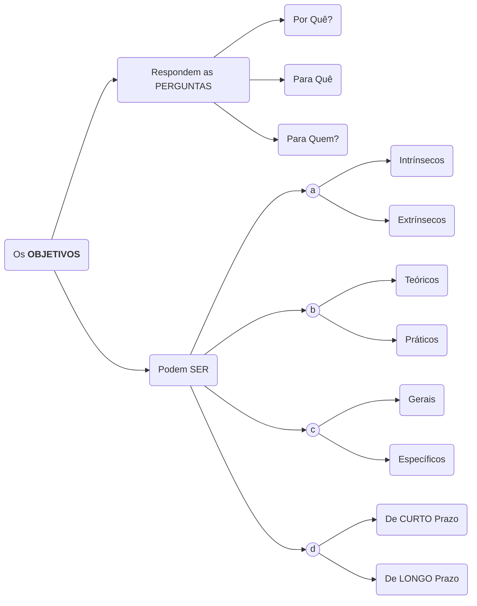
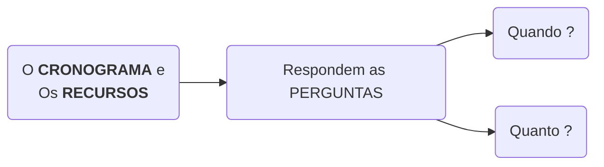
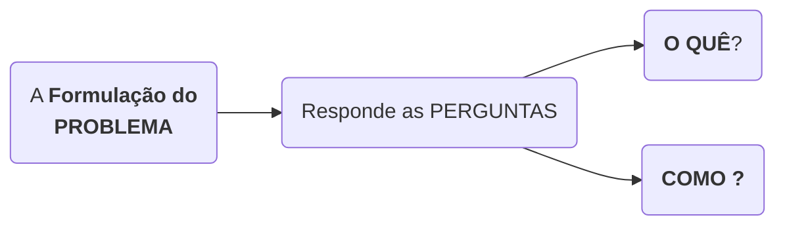

# P1 - Metodologia Científica

capa-livro-fundamentos-metodologia-cientifica-lakatos.png

## Resumo do Livro "**Fundamentos de Metodologia Científica**" (MARCONI; LAKATOS; TEIXEIRA, 2017)

 
</img> 
<b>Figura</b> - Livro "Fundamentos de Metodologia Científica" (MARCONI; LAKATOS; TEIXEIRA, 2017)

### Capítulo 8 - Pesquisa

#### Conceito de Pesquisa

* **Bagno** (2010, p. 17 apud MARCONI; LAKATOS, p. 185) afirma que a palavra PESQUISA chegou até o Português através do Espanhol, que por sua vez assimilou do Latim:
  * Latim *PERQUIRO*:
    * **Significado**: 1. Procurar por toda parte; buscar com cuidado. 2.Inquirir. 3. Perguntar; indagar bem, aprofundar na busca
    * O significado dessa palavra em Latim insiste na **ideia de uma busca feita com cuidado e profundidade**.
* **Ander-Egg** (1978, p. 28 apud MARCONI; LAKATOS, p. 185) a PESQUISA é:
  * Um PROCEDIMENTO:
    * Formal
    * Reflexivo ( Método de Pensamento );
    * Sistemático;
    * Controlado;
    * Crítico
  * Que PERMITE, em qualquer campo do conhecimento, DESCOBRIR
    * Novos fatos ou dados;
    * Relações ou leis
  * Que REQUER
    * Tratamento científico
  * Que CONSTITUI
    * Caminho para CONHECER A REALIDADE
    * Caminho para CONHECER VERDADES PARCIAIS

#### Passos para DESENVOLVIMENTO DE UM PROJETO DE PESQUISA

1. **Seleção** do tópico (Problema) para investigação;
2. **Definição** e **diferenciação** do problema;
3. **Levantamento** de hipóteses de trabalho;
4. **Coleta**, **sistematização** e **classificação** dos dados;
5. **Análise** e **interpretação** dos dados;
6. **Elaboração** do relatório do resultado da pesquisa

##### Planejamento da Pesquisa

##### Preparação da Pesquisa

1. Decisão;
2. Especificação dos objetivos;
3. Elaboração de um plano de trabalho;
4. Constituição da equipe de trabalho;
5. Levantamento de recursos e cronograma
 
#### Fases da Pesquisa

1. Escolha do tema;
2. Levantamento de dados;
3. Formulação do problema;
4. Definição dos termos;
5. Construção de hipóteses;
6. Indicação de variáveis;
7. Delimitação da pesquisa;
8. Amostragem;
9. Seleção de métodos e técnicas;
10. Organização do instrumental de pesquisa;
11. Teste de instrumentos e procedimentos

#### Execução da Pesquisa

1. C3oleta de dados;
2. Elaboração dos dados;
3. Análise e interpretação dos dados;
4. Representação dos dados;
5. Conclusões

#### Relatório de Pesquisa

#### PLANEJAMENTO DA PESQUISA: Preparação da Pesquisa

##### Decisão

* Esse é o momento em que o pesquisador **toma a decisão** de **realizar ou não realizar** a pesquisa;
* A pesquisa pode ser realizada **no INTERESSE**:
  * Do Próprio Pesquisador;
  * De Alguém
  * De Alguma Entidade;
* Nem sempre é fácil se dereminar **o que se pretente investigar**
* A INVESTIGAÇÃO PRESSUPÕE:
  * Uma série de CONHECIMENTOS ANTERIORES;
  * Metodologia adequada

##### Especificação dos objetivos

* O OBJETIVO torna **EXPLÍCITO O PROBLEMA**;
* Os OBJETIVOS orientam a pesquisa para se **SABER**:
  * O QUE se vai PROCURAR;
  * O QUE se pretende ALCANÇAR
* Os objetivos devem **SER**
  * LIMITADOS
  * CLARAMENTE DEFINIDOS
* Os objetivos podem **DEFINIR**
  * A natureza do trabalho;
  * O tipo do problema;
  * O material a coletar

##### Elaboração de um plano de trabalho

* É um passo a passo de como o trabalho de pesquisa será realizado que facilita ou aumenta as suas chances de viabilidade;
* Imprime ordem lógica a sua execução;
* Tornam claros os RECURSOS **materiais**, **humanos** e de **tempo** necessários a sua execução;
* **Pode** ou **não** ser alterado durante sua execução;

##### Constituição da equipe de trabalho

* Engloba
  * Recrutamento de pessoal;
  * Treinamento de pessoal;
  * Distribuição de tarefas;
  * Indicação dos locais de trabalho;
  * Indicação dos materiais e equipamentos
* **Observação**: A pesquisa também pode ser realizada por **uma pessoa** apenas.

##### Levantamento de recursos e cronograma

* O pesquisados deve fazer DE ANTEMÃO a previsão dos gastos necessários para a realização da pesquisa ( orçamento o mais aproximado possível do montante de recursos );
* Não pode falta um cronograma para executar a pesquisa em cada uma de suas etapas

#### PLANEJAMENTO DA PESQUISA: Fases da Pesquisa

##### Escolha do tema;

* O **TEMA** é o **ASSUNTO** que se deseja estudar e pesquisar;
* A **DEFINIÇÃO DO TEMA** <u>pode perdurar por toda a pesquisa</u> e deverá ser **FREQUENTEMENTE REVISTO**;
* ESCOLHA um TEMA/ASSUNTO
  * Que MEREÇA ser investigado cientificamente;
  * Que TENHA CONDIÇÕES de ser, em função da pesquisa:
    * Formulado;
    * Delimitado
    * Exequível (disponibilidade de tempo do pesquisador, background acadêmico, recursos, etc...)
* O TEMA/ASSUNTO deve SER:
  * Preciso
  * Bem determinado
  * Específico

##### Levantamento de dados;

* São TRÊS as formas de OBTENÇÃO DE DADOS:
  * Pesquisa Bibliográfica
  * Pesquisa Documental
  * Contatos Diretos
##### Pesquisa Bibliográfica

* Apanhado geral sobre os **principais trabalhos realizados**
* Procura-se, relacionados ao TEMA:
  * Dados atuais;
  * Dados relevantes;
  * Indícios importantes
  * Subsídios importantes
* Pode orientar indagações sore a pesquisa
* ANTES de qualquer PESQUISA DE CAMPO deve-se realizar uma ANÁLISE MINUCIOSA de FONTES DOCUMENTAIS que sirvam de suporte à pesquisa

##### Investigação Preliminar

* Também chamada de **ESTUDO EXPLORATÓRIO**.
* Deve ser realizada através de **DOIS ASPECTOS**:
  * **DOCUMENTOS**
    * **PRINCIPAIS TIPOS DE DOCUMENTOS**
      a. Fontes **PRIMÁRIAS**:
        a. Dados Históricos;
        b. Dados Bibliográficos;
        c. Dados Estatísticos;
        d. Documentação **pessoal**;
          a. Autobiografias
          b. Certidão de nascimento
          c. Certidão de óbito
          d. Diários
          e. Memórias
        e. Registros de natureza pública/privada
      b. Fontes **SECUNDÁRIOS**
        a. Imprensa em geral
        b. Obras literárias
  * **CONTATOS DIRETOS / PESQUISA DE CAMPO / PESQUISA DE LABORATÓRIO**
    * São realizados com PESSOAS que podem **fornecer os dados diretamente**;
    * São realizadas com PESSOAS que podem **sugerir fontes de informações úteis**;

##### Formulação do problema;

* PROBLEMA:
  * É uma DIFICULDADE, teórica ou prática, NO CONHECIMENTO de alguma coisa;
  * É uma DIFICULDADE para a qual SE QUER ENCONTRAR uma solução;

##### Definição do Problema

  * O que é **DEFINIR O PROBLEMA** ?
    * É especificar a **DIFICULDADE** em detalhes precisos e exatos;
    * É especificar a **DIFICULDADE** com clareza, concisão e objetividade
  * A **CLAREZA DO PROBLEMA** ajuda na CONTRUÇÃO DA HIPÓTESE CENTRAL;
  * **COMO DEVE SER DEFINIDO** o **PROBLEMA** ?
    * Na forma INTERROGATIVA
    * Delimitando-o de forma a indicar as **VARIÁVEIS** que **AFETAM O ESTUDO** com possíveis **RELAÇÕES ENTRE SI**.
  * A **FORMULAÇÃO DE UM PROBLEMA**
    * Requer **CONHECIMENTOS PRÉVIOS** no assunto, exigindo:
      * Materiais informativos
      * Imaginação criadora
  * Deve-se evitar PROBLEMAS MUITO ABRANGENTES, pois tornam a pesquisa MAIS COMPLEXA;

##### APÓS a Definição do Problema

  * **APÓS FORMULADO UM PROBLEMA**, segue-se as **ETAPAS VALORATIVAS**, analisando-se:
    * **Viabilidade**: pode ser eficazmente resolvido através da pesquisa?
    * **Relevância**: é capaz de trazer conhecimentos novos?
    * **Novidade**: está adequado ao estádio atual da evolução científica?
    * **Exequibilidade**: om esse problema, é possível chegar a uma conclusão
válida?
    * **Oportunidade**: o problema atende a INTERESSES **particulares** e **gerais**?

##### Forma de conceber um problema científico

* Qual o OBJETIVO DO TRABALHO DE PESQUISA ?
  * PROBLEMA de : estudo descritivo, de caráter informativO explicativo ou preditivo;
  * PROBLEMA de **INFORMAÇÃO**: coleta de dados a respeito de estruturas e condutas observáveis, dentro de uma área de fenômenos;
  * PROBLEMA de de **AÇÃO**: campos de ação onde determinados conhecimento
sejam aplicados com êxito.
  * INVESTIGAÇÃO **PURA** e **APLICADA**: estuda um problema relativo ao conhecimento científico ou à sua aplicabilidade.

##### Definição dos termos;

* É tornar os TERMOS DA PESQUISA claros, compreensivos, objetivos e adequados que possam dar margem a interpretações errôneas;
* O uso de termos apropriados, consistentemente definidos, CONTRIBUI para a **melhor compreensão da REALIDADE OBSERVADA**;
* Há TERMOS que precisam ser compreendidos com um **SIGNIFICADO ESPECÍFICO**;
* Há dois **TIPOS DE DEFINIÇÕES**:
  * **SIMPLES**: apenas traduzem o significado do termo ou expressão meno
conhecida;
  * **OPERACIONAL**: além do significado, ajudam, com exemplos, na
compreensão do conceito, tornando clara a experiência no mundo
extensional.

##### Construção de hipóteses;

##### Indicação de variáveis;

##### Delimitação da pesquisa;

##### Amostragem;

##### Seleção de métodos e técnicas;

##### Organização do instrumental de pesquisa;

#### Teste de instrumentos e procedimentos

